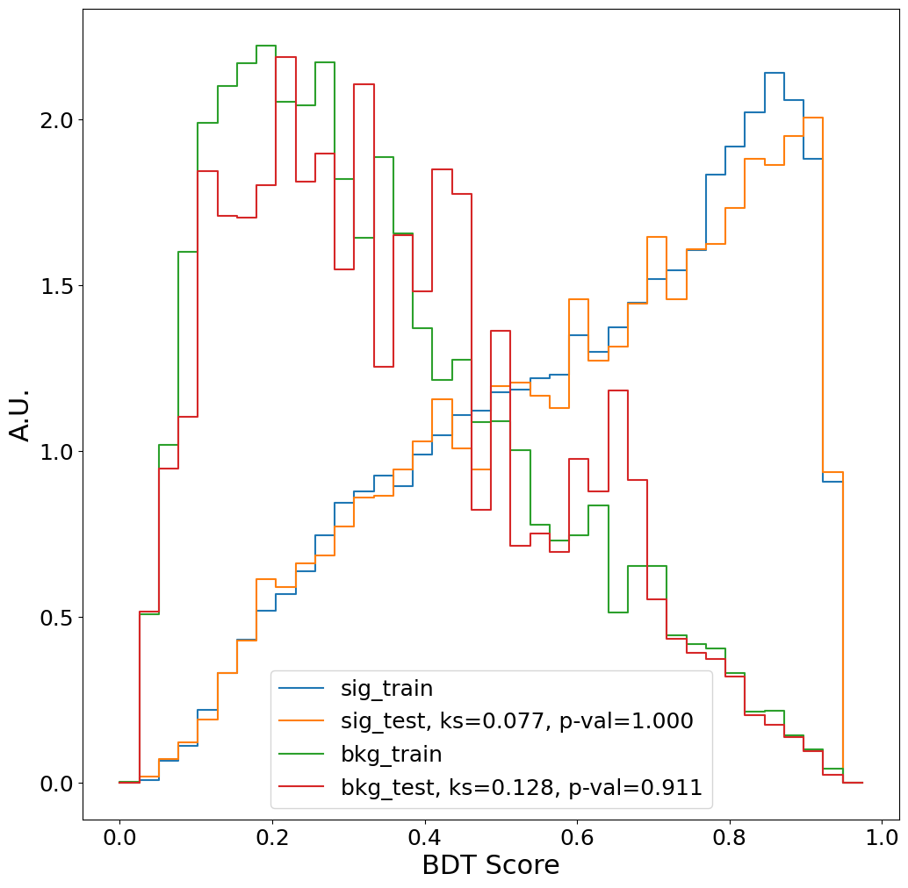

# About this repository

This is a repository that can train a uBoost or xgboost BDT for the SVJ boosted analysis.
It uses as much training data as it can, by using the precalculated TreeMaker Weight column.


## Setup

Assuming you have `conda` installed, create the environment with the following command:

```bash
git clone git@github.com:boostedsvj/svj_uboost
cd svj_uboost
conda env create -f environment.yaml
```

Then activate the environment with the command:

```bash
conda activate svj_uboost
```

Alternatively, an editable `svj_ntuple_processing` can be installed for simultaneous developments:

```bash
git clone git@github.com:boostedsvj/svj_ntuple_processing
# Run in conda environment
pip install -e svj_ntuple_processing/
```

Optional additional packages to read files over xrootd directly instead of making local copies (may not work on all machines):

```bash
# Run in conda environment
pip install xrootd
pip install fsspec-xrootd
```

## Skims

A minimal setup just to run the skims (avoiding the need for a heavy conda environment):
```
git clone git@github.com:boostedsvj/svj_uboost
cd svj_uboost
python3 -m venv venv
source venv/bin/activate
pip install git+https://github.com/boostedsvj/jdlfactory
pip install git+https://github.com/boostedsvj/seutils
pip install --ignore-installed --no-cache "numpy<2"
pip install --no-cache awkward
pip install --no-cache numba
pip install git+https://github.com/boostedsvj/svj_ntuple_processing
```

The skim code can be tested interactively:
```
python3 skim.py --stageout root://cmseos.fnal.gov//store/user/lpcdarkqcd/boosted/skims_test [filename]
```

To submit all skim jobs:
```
python3 submit_skim.py --stageout root://cmseos.fnal.gov//store/user/lpcdarkqcd/boosted/skims_[date] --go
```
(The argument `--keep X` can be included to select a random subset of signal events for statistical studies, where `X` is a float between 0 and 1.)

Then hadd the skims to get one file per sample:
```
python3 hadd_skims.py --stageout root://cmseos.fnal.gov//store/user/lpcdarkqcd/boosted/skims_[date]_hadd "root://cmseos.fnal.gov//store/user/lpcdarkqcd/boosted/skims_[date]/*/*"
```

For the n-minus-one skims, you can run the skims interactively:
```
python3 skim.py --skip_cut=rt --stageout root://cmseos.fnal.gov//store/user/lpcdarkqcd/boosted/skims_test [filename]
```
Or to submit n-minus-one skims for all file skipping a specific cut:
```
python3 submit_skim.py --skip_cut=rt --stageout root://cmseos.fnal.gov//store/user/lpcdarkqcd/boosted/skims_n_minus_one_[date] --go
```

The currently allowed values for the `--skip_cut` arguments are `"rt"`,
`"muon_veto"`, `"electron_veto"` and `"metdphi"`. Notice that the `--skip_cut`
flag is not needed when creating the hadd-ed skim files, we just need to
change the input and output directories:
```
python3 hadd_skims.py --stageout root://cmseos.fnal.gov//store/user/lpcdarkqcd/boosted/skims_n_minus_one_[date]_hadd "root://cmseos.fnal.gov//store/user/lpcdarkqcd/boosted/skims_n_minus_one_[date]/*/*"
```


## How to run a training

The shell script `run_iter_training.sh` provides an example of all the commands necessary to complete an iterative training.
The explicit steps are outlined below:


First download the training data (~4.7 Gb), and split it up into a training and test sample:

```bash
python download.py
python split_train_test.py
```

This should give you the following directory structure:

```bash
$ ls data/
bkg  signal  test_bkg  test_signal  train_bkg  train_signal

$ ls data/train_bkg/Summer20UL18/
QCD_Pt_1000to1400_TuneCP5_13TeV_pythia8.npz
QCD_Pt_120to170_TuneCP5_13TeV_pythia8.npz
... <more>
```

Then there are two options for training:

The first is the  iterative training developed for the boosted SVJ search. This training is quite configurable, but defaults to optimal hyperparameters as recorded in the boosted SVJ AN. An example for the iterative training is below:

```bash
# Standard Iterative training
python iter_training.py xgboost \
  --qcd_files <qcd_train_path_and_filenames>\
  --tt_files <tt_train_path_and_filenames>\
  --sig_files <sig_train_path_and_filenames>\
  --out <model_name> --verbosity 2
# For customization see arguments menu
python iter_training.py -h
```

The second option is the legacy training script which does not include the iterative training:

```bash
#Legacy training script, usage not recommended
python training.py xgboost \
  --reweight mt --ref data/train_signal/madpt300_mz350_mdark10_rinv0.3.npz \
  --lr .05 \
  --minchildweight .1 \
  --maxdepth 6 \
  --subsample 1. \
  --nest 400
```

Training with xgboost on the full background should take about 45 min.
The script `hyperparameteroptimization.py` runs this command for various settings in parallel.

### Evaluate

The first evaluation script is rather generic and plots a general ROC curve, mT distribution, and score histogram.

```bash
python evaluate.py --model <model_path_and_name> 
```

The second plots AUC scores versus signal masses against different backgrounds in +/- 100 GeV windows around the signal masses.


```bash
python evaluate_auc_vs_mz.py --model <model_path_and_name> 
  --qcd_files <qcd_test_path_and_filenames>\
  --tt_files <tt_test_path_and_filenames>\
  --sig_files <sig_test_path_and_filenames>\
  --mt-halfwindow <desired_mt-window> \ # standard 100
```

The third is a simple file that ranks the feature importance of the model

```bash
python feature_importance.py --model <model_path_and_name>
```

And finally a script to determine the correlation matrix

```bash
python correlation_matrix.py --model  <model_path_and_name>
```


### Create and apply a DDT

The boosted search is using a DDT to decorrelate the variable selection with MT. For the creation of the the typical DDT
using the BDT, run the following commands:

```bash
# Create the BDT on QCD background and plot 2D maps
python apply_DDT.py --ddt_map_file models/<new_file_name>.json --bkg_files "root://cmseos.fnal.gov//store/user/lpcdarkqcd/boosted/skims_20241030_hadd/Summer20UL*/QCD*.npz" --plot 2D_DDT_map
# Determining the optimal cut value by computing the selection event count of the full background sample and then comparing with signal samples
python apply_DDT.py --ddt_map_file models/<new_file_name>.json --bkg_files "root://cmseos.fnal.gov//store/user/lpcdarkqcd/boosted/skims_20241030_hadd/Summer20UL*/*.npz" --sig_files "root://cmseos.fnal.gov//store/user/lpcdarkqcd/boosted/skims_20241030_hadd/Private*/*.npz" --plot fom_significance
# Plot mt score comparisons to check for MT spectrum sculpting
python apply_DDT.py --plot bkg_scores_mt sig_mt_single_BDT one_sig_mt_many_bdt --bkg_files "data/bkg_20241030/Summer20UL*/*.npz" --bdt_cuts 0.1 0.2 0.3 0.4 0.5 0.6 0.7 0.8 0.9
```

For the cut-based analysis, run the following commands:

```bash
# Create the DDT on using all background samples and plot 2D maps, we also generate the FOM significance plot in the same command
python apply_DDT.py --analysis_type cut-based --ddt_map_file models/<new_file_name>.json --bkg_files "root://cmseos.fnal.gov//store/user/lpcdarkqcd/boosted/skims_20241030_hadd/Summer20UL*/*.npz" --sig_files "root://cmseos.fnal.gov//store/user/lpcdarkqcd/boosted/skims_20241030_hadd/Private*/*.npz" --plot 2D_DDT_map fom_significance
# Plot mt score comparisons for a select few ECF working points using the full bkg
python apply_DDT.py --analysis_type cut-based --ddt_map_file models/<new_file_name>.json --bkg_files "data/bkg_20241030/Summer20UL*/*.npz" --ecf_cuts 0.08 0.09 0.10 0.11 0.12 --plot bkg_scores_mt
```

Because we need a larger control region for the ralphabet method, a loose
control region is defined by relaxing the RT requirements. Instead of directly
performing event selection on the event RT value, an additional DDT map is
computed for RT. To compute this RT-DDT map, run the following commands:

```bash
# Creating the the RT-DDT map using the full background sample, and scanning for an optimal cut point
python apply_DDT.py --analysis_type RT --ddt_map_file ./models/<rt_ddt_name>.json --bkg_files "root://cmseos.fnal.gov//store/user/lpcdarkqcd/boosted/skims_20241030_hadd/Summer20UL*/*.npz" --sig_files "root://cmseos.fnal.gov//store/user/lpcdarkqcd/boosted/skims_20241030_hadd/Private*/*.npz" --plot 2D_DDT_map fom_significance
# Plotting the events that pass/fail the RT-DDT selection to check for MT sculpting
python apply_DDT.py --analysis_type RT --ddt_map_file ./models/<rt_ddt_name>.json --bkg_files "root://cmseos.fnal.gov//store/user/lpcdarkqcd/boosted/skims_20241030_hadd/Summer20UL*/*.npz" --sig_files "root://cmseos.fnal.gov//store/user/lpcdarkqcd/boosted/skims_20241030_hadd/Private*/*.npz" --var_cuts 1.16 1.17 1.18 1.19 1.20 --plot bkg_scores_mt
```

After the RT-DDT map, this should be used to re-compute the ECF and BDT-DDT maps:

```bash
# Re-running the ECF-ddt map with a different selection point (note the new rt_sel and rt_ddt_file arguments
python apply_DDT.py --analysis_type cut-based --rt-sel 1.20 --rt_ddt_file ./models/<rt_ddt_name>.json  --ddt_map_file models/<new_file_name>.json --bkg_files "root://cmseos.fnal.gov//store/user/lpcdarkqcd/boosted/skims_20241030_hadd/Summer20UL*/*.npz" --sig_files "root://cmseos.fnal.gov//store/user/lpcdarkqcd/boosted/skims_20241030_hadd/Private*/*.npz" --plot 2D_DDT_map fom_significance
# Similar for the BDT-DDT map re calculation
python apply_DDT.py --analysis_type BDT-based --rt-sel 1.20 --rt_ddt_file ./models/<rt_ddt_name>.json --ddt_map_file models/<new_file_name>.json --bkg_files "root://cmseos.fnal.gov//store/user/lpcdarkqcd/boosted/skims_20241030_hadd/Summer20UL*/QCD*.npz" --plot 2D_DDT_map fom_significance
```

A collection of all these commands can be found in the `./run_ddt_construct.sh` script


### Overfitting check: Kolmogorov-Smirnov test

```bash
python overfitting.py models/svjbdt_Nov29_reweight_mt_lr0.05_mcw0.1_maxd6_subs1.0_nest400.json
```



With p-values close to 1.0, there is no reason to assume any overfitting.

## Cutflow table

```bash
python makeCutflowSVJ.py -o svj.tex -d skims_20240718_hadd -t rawrel -p 0 -k raw preselection 'n_ak4jets>=2' -l '180<mt<650' --compile
```

Creates the cutflow tables in LaTeX format, along with a compiled pdf (`--compile` argument, requires that LaTeX is installed).

## Building Data Cards

One of the key files in this repo is the `build_datacard.py` this is the magic file that makes everything come together. Here, datacards that can be fed into combine are built.

Taking the skims as input (with the consistent preselection applied to all samples), output MT histograms are produced for a specified final selection (either cutbased or bdt=X for a working point X; DDT is applied).
The final selection also includes the HEM veto for the 2018POST era.
For signals, systematic variations are evaluated, and a wider mT range is used to facilitate smoothing of the shapes (using local regression;
the optimization of the smoothing span via generalized cross-validation uses the central histogram, and then that optimized span value is applied to the systematic variations).
Histograms are then merged across all data-taking years and smoothed in some cases.

The commands to perform all steps (histograms, merging, smoothing) for all categories (data, background, signal) are executed by `build_all.sh`.
The desired selection(s) can be specified using the `--sels` argument (and are internally expanded to include the anti-tag control regions):
```bash
./build_all.sh --sels "cutbased_ddt=0.12 bdt=0.75"
```

These merged, smoothed json files are the inputs to the limit setting. The signal, background, and (optionally) data are supplied separately.

## Creating the n-minus-one and preselection distribution histograms

The `build_datacard.py` script can also be used to create the histogram JSON
files for the distribution of other variables in the preselection region:
```bash
# Creating the "preselection" distribution of vairables ecfm2b1 and mt for background MC samples
python3 build_datacard.py build_all_histograms preselection "root://cmseos.fnal.gov//store/user/lpcdarkqcd/boosted/skims_20240718_hadd/Summer*/*.npz" --hist_var_list ecfm2b1 mt
# Histogram merging needs to be done separately as rebinning needs to be done on a per vairable basis
python3 build_datacard.py merge_histograms preselection hists_[date] --cat bkg --hist_var ecfm2b1
python3 build_datacard.py merge_histograms preselection hists_[date] --cat bkg --hist_var mt
```
The script can also be used for histograms used the n-minus-one plots. Notice
that the cut that was skipped in the production of n-minus-one skims are stored
as part of the dataset name, so adjust your input wildcard to reflect this.
Also, because that n-minus-one skims does not store all variables to reduce
file size, not all variables can be plotted with all n-minus-one variants. The
following example is used for the n-minus-one histograms of the RT variable
using signal samples.
```bash
# Notice the wildcard postfix for the input files
python3 build_datacard.py build_all_histograms preselection_minus "root://cmseos.fnal.gov//store/user/lpcdarkqcd/boosted/skim_n_minus_one_[date]/Private3D*/*pythia8*skip_cut-rt.npz" --hist_var_list rt --fullyear
# The merge instructions also needs to be slightly adjusted
python3 build_datacard.py merge_histograms preselection_minus-rt hists_[date] --cat sig --hist_var rt --years 2016 2017 2018
```

## Extras

An additional function for checking the histogram json files is `ls`. However, this is not the most easy to read it provides a quick way to check for mistakes during file creation.

```bash
python3 build_datacard.py ls signal_name_cutbased_or_bdt_with_bkg_binwXY_rangeXYZ-XYZ.json
# or alternatively, just look at it
head -n 100 signal_name_cutbased_or_bdt_with_bkg_binwXY_rangeXYZ-XYZ.json
```

Then all the up, down, and nominal values can be plotted for the systematics:

```bash
python build_datacard.py plot_systematics signal_name_cutbased_or_bdt_with_bkg_binwXY_rangeXYZ-XYZ.json
```

Similar plots can be made to compare the results of smoothing (e.g. for systematics, between different `keep` percentages, etc.) using the `plot_smooth` function.

A table of systematic uncertainty yield effects can be made as follows:
```bash
python build_datacard.py systematics_table signal_name_cutbased_or_bdt_with_bkg_binwXY_rangeXYZ-XYZ.json
```
Currently, this function only handles one signal model at a time.
It will be expanded to summarize across all signal models once the full scans are available.

And that's it for this part. To use these histograms for fits and limit setting, see the [svj_limits](https://github.com/boostedsvj/svj_limits) repo.

